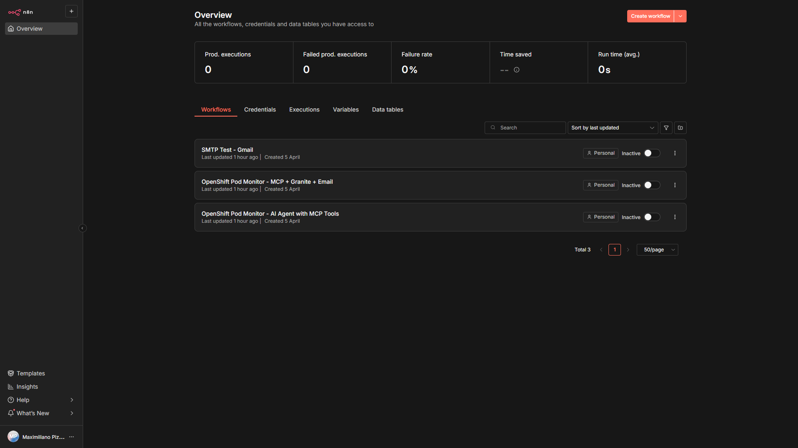
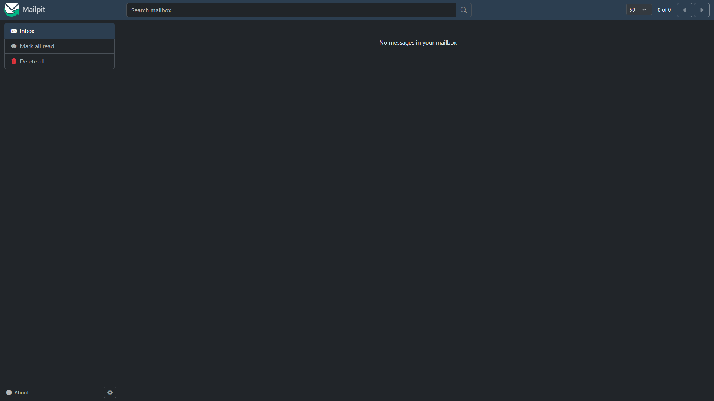

<link rel="icon" href="favicon.svg" type="image/svg+xml">
<link rel="alternate icon" href="https://raw.githubusercontent.com/maximilianoPizarro/botpress-helm-chart/main/favicon-152.ico" type="image/x-icon">

  <h1>n8n Helm Chart</h1>
  
Deploy n8n workflow automation on <strong>Kubernetes</strong> and <strong>Red Hat OpenShift</strong> with native AI capabilities, OpenShift MCP Server integration, and Developer Sandbox support.

  

    
    
    
    
  

  

    <a href="#installation" class="cta-btn cta-primary">Get Started</a>
    <a href="https://github.com/maximilianoPizarro/n8n-helm-chart" class="cta-btn cta-secondary">View on GitHub</a>
  

  <h2>Features</h2>
  

    

      
&#9881;

      <h3>OpenShift Native</h3>
      
First-class support for Red Hat OpenShift including Routes, SCCs, and Developer Sandbox compatibility with restricted security contexts.

    

    

      
&#129302;

      <h3>AI-Powered Workflows</h3>
      
Integrate with OpenShift AI models like IBM Granite 3.1 via LiteLLM proxy and MCP Server for intelligent infrastructure monitoring.

    

    

      
&#9993;

      <h3>Mailpit Integration</h3>
      
Optional built-in Mailpit SMTP test server for previewing email reports from workflows without external email infrastructure.

    

    

      
&#128736;

      <h3>MCP Server Support</h3>
      
Connect to OpenShift and Kubernetes MCP Servers to query cluster state, analyze pods, deployments, routes, and security posture.

    

    

      
&#128200;

      <h3>Production Ready</h3>
      
Supports queue mode with Valkey/Redis, worker autoscaling, PostgreSQL backend, ServiceMonitor for Prometheus, and HPA.

    

    

      
&#128274;

      <h3>Security First</h3>
      
Non-root containers, restricted SCC support, enableServiceLinks control, and proper RBAC with dynamic naming.

    

  

  <h2>Architecture</h2>
  

<pre>
┌──────────────┐     ┌────────────────────┐     ┌──────────────────┐     ┌──────────────┐
│   n8n        │────▶│  LiteLLM Proxy     │────▶│  OpenShift MCP   │────▶│  Kubernetes  │
│   Workflow   │     │  + Granite 3.1 8B  │     │  Server          │     │  API         │
│   Engine     │     │  + Qwen 3 8B       │     │  + K8s MCP       │     │              │
└──────┬───────┘     └────────────────────┘     └──────────────────┘     └──────────────┘
       │
       ▼
┌──────────────┐
│  Mailpit     │
│  SMTP/Web UI │
│  (Optional)  │
└──────────────┘
</pre>
  

  <table class="styled-table">
    <thead>
      <tr><th>Component</th><th>Description</th></tr>
    </thead>
    <tbody>
      <tr><td><strong>n8n</strong></td><td>Workflow automation engine deployed via Helm</td></tr>
      <tr><td><strong>LiteLLM</strong></td><td>OpenAI-compatible proxy routing to Granite/Qwen models</td></tr>
      <tr><td><strong>OpenShift MCP Server</strong></td><td>MCP server exposing OpenShift/Kubernetes API as tools</td></tr>
      <tr><td><strong>K8s MCP Server</strong></td><td>Additional Kubernetes-native MCP tool server</td></tr>
      <tr><td><strong>Mailpit</strong></td><td>Lightweight SMTP test server with web UI (optional)</td></tr>
    </tbody>
  </table>

  <h2>Screenshots</h2>

  <h3>OpenShift MCP Server Workflow Examples</h3>
  

    

      
      
Pod Monitor - AI Agent with MCP Tools

    

    

      
      
Pod Monitor - MCP + Granite + Email

    

    

      
      
SMTP Test - Email via Mailpit

    

  

  <h3>Dashboard &amp; Services</h3>
  

    

      
      
n8n Workflow List - OpenShift MCP Workflows

    

    

      
      
n8n Dashboard Overview

    

    

      
      
Mailpit - Email Testing Web UI

    

  

  <h2>Installation</h2>
  

    
1

    

      <strong>Add the Helm repository</strong>
      
helm repo add n8n-openshift https://maximilianopizarro.github.io/n8n-helm-chart/ helm repo update

    

  

  

    
2

    

      <strong>Install the chart</strong>
      
helm install n8n n8n-openshift/n8n --version 1.16.0

    

  

  

    
3

    

      <strong>Install on OpenShift Developer Sandbox</strong>
      
oc login --token=&lt;your-token&gt; --server=https://api.&lt;cluster&gt;.openshiftapps.com:6443 helm install n8n n8n-openshift/n8n -f values-sandbox.yaml

    

  

  <h2>Developer Sandbox Quick Start</h2>
  
For Red Hat OpenShift Developer Sandbox, use these values to ensure compatibility with restricted SCCs:

  
enableServiceLinks: false  podSecurityContext: {} securityContext: &nbsp;&nbsp;allowPrivilegeEscalation: false &nbsp;&nbsp;capabilities: &nbsp;&nbsp;&nbsp;&nbsp;drop: &nbsp;&nbsp;&nbsp;&nbsp;&nbsp;&nbsp;- ALL &nbsp;&nbsp;readOnlyRootFilesystem: false &nbsp;&nbsp;runAsNonRoot: true  route: &nbsp;&nbsp;enabled: true &nbsp;&nbsp;sccRoleDisabled: true  main: &nbsp;&nbsp;config: &nbsp;&nbsp;&nbsp;&nbsp;n8n: &nbsp;&nbsp;&nbsp;&nbsp;&nbsp;&nbsp;user_folder: "/data" &nbsp;&nbsp;persistence: &nbsp;&nbsp;&nbsp;&nbsp;enabled: true &nbsp;&nbsp;&nbsp;&nbsp;storageClass: gp3-csi &nbsp;&nbsp;&nbsp;&nbsp;size: 2Gi &nbsp;&nbsp;&nbsp;&nbsp;mountPath: "/data" &nbsp;&nbsp;service: &nbsp;&nbsp;&nbsp;&nbsp;type: ClusterIP &nbsp;&nbsp;&nbsp;&nbsp;port: 5678  mailpit: &nbsp;&nbsp;enabled: true &nbsp;&nbsp;route: &nbsp;&nbsp;&nbsp;&nbsp;enabled: true &nbsp;&nbsp;podSecurityContext: {}

  <table class="styled-table">
    <thead>
      <tr><th>Setting</th><th>Value</th><th>Reason</th></tr>
    </thead>
    <tbody>
      <tr><td><code>enableServiceLinks</code></td><td><code>false</code></td><td>Avoids N8N_PORT env conflict in OpenShift</td></tr>
      <tr><td><code>route.sccRoleDisabled</code></td><td><code>true</code></td><td>Developer Sandbox users cannot create SCC Roles</td></tr>
      <tr><td><code>main.config.n8n.user_folder</code></td><td><code>/data</code></td><td>Writable path for random UID assigned by OpenShift</td></tr>
      <tr><td><code>main.persistence.mountPath</code></td><td><code>/data</code></td><td>Mount PVC at writable path instead of /home/node/.n8n</td></tr>
      <tr><td><code>podSecurityContext</code></td><td><code>{}</code></td><td>No fsGroup (restricted SCC)</td></tr>
      <tr><td><code>main.persistence.storageClass</code></td><td><code>gp3-csi</code></td><td>Sandbox default StorageClass</td></tr>
    </tbody>
  </table>

  <h2>OpenShift MCP Server Workflow Examples</h2>
  
These workflows query the Kubernetes API through the MCP (Model Context Protocol) server, feed the results to an IBM Granite 3.1 8B model for analysis, and deliver a branded HTML email report via Mailpit.

  

    <h4>1. Pod Monitor - AI Agent with MCP Tools</h4>
    
Queries all pods in the namespace via MCP tools, analyzes status with Granite AI (running, pending, CrashLoopBackOff), and sends an HTML email report with Red Hat branding.

    

      Granite 3.1 8B
      OpenShift MCP
      Manual Trigger
    

  

  

    <h4>2. Pod Monitor - MCP + Granite + Email</h4>
    
Simplified pod monitoring workflow that directly calls the Kubernetes API for pod listing, uses Granite for reasoning, and sends a branded email report.

    

      Granite 3.1 8B
      K8s MCP
      Manual Trigger
    

  

  

    <h4>3. Deployment Rollout Status</h4>
    
Analyzes all Deployments: replica health (desired vs available vs ready), rollout strategy, container image versions, and last rollout conditions. Flags deployments with replica mismatches.

    

      Granite 3.1 8B
      K8s MCP
      Manual Trigger
    

  

  

    <h4>4. Resource Quota Monitor</h4>
    
Scheduled capacity planning: checks ResourceQuota usage, LimitRange configs, aggregate resource consumption, top consumers, and PVC utilization. Flags resources above 80% threshold.

    

      Granite 3.1 8B
      OpenShift MCP
      Schedule (6h)
    

  

  

    <h4>5. Security Audit</h4>
    
Namespace security posture assessment: ServiceAccount roles, privilege escalation, SCC usage, NetworkPolicy, Secrets audit, resource limits enforcement, image registry trust. Findings classified as PASS, WARNING, or CRITICAL.

    

      Granite 3.1 8B
      OpenShift MCP
      Manual Trigger
    

  

  

    <h4>6. Route &amp; TLS Expiry Check</h4>
    
Daily check of all Routes and TLS configuration: termination type, certificate expiry, insecure traffic detection. Alerts on certificates expiring within 30 days.

    

      Granite 3.1 8B
      OpenShift MCP
      Schedule (daily)
    

  

  

    <h4>7. Event Anomaly Detector</h4>
    
Runs every 30 minutes to detect anomalous Kubernetes Events: repeated warnings, OOMKilled, FailedScheduling, image pull errors. Conditional email alerts only when anomalies are found.

    

      Granite 3.1 8B
      K8s MCP
      Schedule (30min)
    

  

  
Find all workflow JSON files in the <a href="https://github.com/maximilianoPizarro/n8n-sandbox/tree/main/workflows">n8n-sandbox repository</a>.

  <h2>Mailpit Email Output</h2>
  
When Mailpit is enabled, n8n workflows can send branded HTML email reports that are captured and viewable in the Mailpit web UI. Configure n8n SMTP credentials to point to the Mailpit service:

  
main: &nbsp;&nbsp;config: &nbsp;&nbsp;&nbsp;&nbsp;n8n: &nbsp;&nbsp;&nbsp;&nbsp;&nbsp;&nbsp;smtp_host: "&lt;release-name&gt;-mailpit" &nbsp;&nbsp;&nbsp;&nbsp;&nbsp;&nbsp;smtp_port: "1025" &nbsp;&nbsp;&nbsp;&nbsp;&nbsp;&nbsp;smtp_ssl: "false"

  
Access the Mailpit web UI via its OpenShift Route to view all captured email reports from your workflows.

  <h2>Configuration</h2>
  <h3>N8n Configuration via Values</h3>
  
Configuration under <code>main.config:</code> and <code>main.secret:</code> in <code>values.yaml</code> is transformed 1:1 into Kubernetes ENV variables:

  
main: &nbsp;&nbsp;config: &nbsp;&nbsp;&nbsp;&nbsp;n8n: &nbsp;&nbsp;&nbsp;&nbsp;&nbsp;&nbsp;encryption_key: "my_secret"&nbsp;&nbsp;# =&gt; N8N_ENCRYPTION_KEY=my_secret &nbsp;&nbsp;&nbsp;&nbsp;db: &nbsp;&nbsp;&nbsp;&nbsp;&nbsp;&nbsp;type: postgresdb&nbsp;&nbsp;&nbsp;&nbsp;&nbsp;&nbsp;&nbsp;&nbsp;&nbsp;&nbsp;&nbsp;&nbsp;&nbsp;# =&gt; DB_TYPE=postgresdb &nbsp;&nbsp;&nbsp;&nbsp;&nbsp;&nbsp;postgresdb: &nbsp;&nbsp;&nbsp;&nbsp;&nbsp;&nbsp;&nbsp;&nbsp;host: 192.168.0.52&nbsp;&nbsp;&nbsp;&nbsp;&nbsp;&nbsp;&nbsp;&nbsp;&nbsp;# =&gt; DB_POSTGRESDB_HOST=192.168.0.52

  
Consult the <a href="https://docs.n8n.io/hosting/configuration/environment-variables/">n8n Environment Variables Documentation</a>.

  <h3>Enabling Mailpit</h3>
  
mailpit: &nbsp;&nbsp;enabled: true &nbsp;&nbsp;route: &nbsp;&nbsp;&nbsp;&nbsp;enabled: true&nbsp;&nbsp;# Expose web UI via OpenShift Route &nbsp;&nbsp;smtp: &nbsp;&nbsp;&nbsp;&nbsp;port: 1025 &nbsp;&nbsp;ui: &nbsp;&nbsp;&nbsp;&nbsp;port: 8025

  <h3>Basic Deployment with Ingress</h3>
  
ingress: &nbsp;&nbsp;enabled: true &nbsp;&nbsp;hosts: &nbsp;&nbsp;&nbsp;&nbsp;- host: n8n.mydomain.com &nbsp;&nbsp;&nbsp;&nbsp;&nbsp;&nbsp;paths: &nbsp;&nbsp;&nbsp;&nbsp;&nbsp;&nbsp;&nbsp;&nbsp;- path: / &nbsp;&nbsp;&nbsp;&nbsp;&nbsp;&nbsp;&nbsp;&nbsp;&nbsp;&nbsp;pathType: Prefix

  <h3>Queue Mode with External Redis</h3>
  
db: &nbsp;&nbsp;type: postgresdb  externalPostgresql: &nbsp;&nbsp;host: "postgresql.example.com" &nbsp;&nbsp;username: "n8nuser" &nbsp;&nbsp;password: "secure-password" &nbsp;&nbsp;database: "n8n"  worker: &nbsp;&nbsp;mode: queue  externalRedis: &nbsp;&nbsp;host: "redis.example.com" &nbsp;&nbsp;username: "default" &nbsp;&nbsp;password: "secure-password"

  <h2>Container Image</h2>
  
A Red Hat UBI-based container image is available at <code>quay.io/maximilianopizarro/n8n</code>. It clones the official n8n source, builds it, and runs on a Red Hat certified base image (<code>registry.access.redhat.com/ubi9/nodejs-22</code>).

  
image: &nbsp;&nbsp;repository: quay.io/maximilianopizarro/n8n &nbsp;&nbsp;tag: "1.123.28"

  
The image is built automatically via GitHub Actions on every push to <code>main</code>.

  <h2>Requirements</h2>
  <table class="styled-table">
    <thead>
      <tr><th>Requirement</th><th>Version</th></tr>
    </thead>
    <tbody>
      <tr><td>Kubernetes</td><td>&gt;= 1.20.0</td></tr>
      <tr><td>Helm</td><td>&gt;= 3.8</td></tr>
      <tr><td>Database</td><td>SQLite (embedded) or PostgreSQL</td></tr>
    </tbody>
  </table>
  <table class="styled-table">
    <thead>
      <tr><th>Dependency</th><th>Version</th><th>Condition</th></tr>
    </thead>
    <tbody>
      <tr><td>Valkey (Bitnami)</td><td>2.4.7</td><td><code>valkey.enabled</code></td></tr>
    </tbody>
  </table>

  <h2>Chart Verification</h2>
  
This chart is verified with the Red Hat Community Helm Chart certification process:

  
podman run --rm -i \ &nbsp;&nbsp;-e KUBECONFIG=/.kube/config \ &nbsp;&nbsp;-v "$HOME/.kube":/.kube:z \ &nbsp;&nbsp;"quay.io/redhat-certification/chart-verifier" \ &nbsp;&nbsp;verify --set profile.vendorType=community,profile.version=v1.1 \ &nbsp;&nbsp;https://maximilianopizarro.github.io/n8n-helm-chart/n8n-1.16.0.tgz

  <h2>Upgrading</h2>
  <h3>Version 1.16.0</h3>
  
<strong>New Features:</strong>

  <ul>
    <li>Mailpit as optional SMTP test service</li>
    <li><code>enableServiceLinks</code> for Developer Sandbox compatibility</li>
    <li>OpenShift MCP Server workflow examples with auto-import</li>
    <li>Dynamic naming in RBAC resources</li>
    <li>Configurable volume mount path (<code>main.persistence.mountPath</code>)</li>
    <li><code>route.sccRoleDisabled</code> for Developer Sandbox RBAC compatibility</li>
    <li>Red Hat UBI-based container image at <code>quay.io/maximilianopizarro/n8n</code></li>
  </ul>
  <h3>Uninstall</h3>
  
helm uninstall [RELEASE_NAME]

  <h3>Upgrade</h3>
  
helm upgrade [RELEASE_NAME] n8n-openshift/n8n --version 1.16.0

<footer class="site-footer">
  
<strong>n8n Helm Chart</strong> &mdash; Maintained by <a href="https://github.com/maximilianoPizarro">maximilianoPizarro</a>

  
n8n is licensed under <a href="https://github.com/n8n-io/n8n/blob/master/LICENSE.md">Sustainable Use License</a>. IBM Granite models are licensed under <a href="https://www.apache.org/licenses/LICENSE-2.0">Apache 2.0</a>.

  
<a href="https://github.com/maximilianoPizarro/n8n-helm-chart">GitHub</a> &bull; <a href="https://artifacthub.io/packages/search?repo=n8n-openshift">Artifact Hub</a> &bull; <a href="https://n8n.io/">n8n.io</a>

</footer>
