<link rel="icon" href="favicon.svg" type="image/svg+xml">
<link rel="alternate icon" href="https://raw.githubusercontent.com/maximilianoPizarro/botpress-helm-chart/main/favicon-152.ico" type="image/x-icon">

  <h1>n8n Helm Chart</h1>
  
Deploy n8n workflow automation on <strong>Kubernetes</strong> and <strong>Red Hat OpenShift</strong> with native AI capabilities, OpenShift MCP Server integration, and Developer Sandbox support.

  

    
    
    
    
    
    
  

  

    <a href="#installation" class="cta-btn cta-primary">Get Started</a>
    <a href="https://github.com/maximilianoPizarro/n8n-helm-chart" class="cta-btn cta-secondary">View on GitHub</a>
  

  <h2>Features</h2>
  

    

      
&#9881;

      <h3>OpenShift Native</h3>
      
First-class support for Red Hat OpenShift including Routes, SCCs, and Developer Sandbox compatibility with restricted security contexts.

    

    

      
&#129302;

      <h3>AI-Powered Workflows</h3>
      
Integrate with OpenShift AI models like IBM Granite 3.1 via LiteLLM proxy and MCP Server for intelligent infrastructure monitoring.

    

    

      
&#9993;

      <h3>Mailpit Integration</h3>
      
Optional built-in Mailpit SMTP test server for previewing email reports from workflows without external email infrastructure.

    

    

      
&#128736;

      <h3>MCP Server Support</h3>
      
Connect to OpenShift and Kubernetes MCP Servers to query cluster state, analyze pods, deployments, routes, and security posture.

    

    

      
&#128200;

      <h3>Production Ready</h3>
      
Supports queue mode with Valkey/Redis, worker autoscaling, PostgreSQL backend, ServiceMonitor for Prometheus, and HPA.

    

    

      
&#128274;

      <h3>Security First</h3>
      
Non-root containers, restricted SCC support, enableServiceLinks control, and proper RBAC with dynamic naming.

    

  

  <h2>Architecture</h2>
  

    

graph LR
  subgraph HELM["n8n Helm Chart"]
    N8N["🔧 n8n Workflow Engine <i>n8nio/n8n</i>"]
    MAIL["✉️ Mailpit SMTP Test Server <i>Optional</i>"]
    PVC["💾 PVC Persistent Data"]
  end

  subgraph AI["AI & MCP Layer"]
    LITE["🤖 LiteLLM Proxy OpenAI-compatible"]
    GRANITE["🧠 IBM Granite 3.1 8B"]
    QWEN["🧠 Qwen 3 8B"]
  end

  subgraph MCP["MCP Servers"]
    OSMCP["☸️ OpenShift MCP Server"]
    K8SMCP["☸️ K8s MCP Server"]
  end

  K8SAPI["☁️ Kubernetes API"]

  N8N -->|"AI Analysis"| LITE
  N8N -->|"Email Reports"| MAIL
  N8N --- PVC
  LITE --> GRANITE
  LITE --> QWEN
  N8N -->|"MCP Tools"| OSMCP
  N8N -->|"MCP Tools"| K8SMCP
  OSMCP --> K8SAPI
  K8SMCP --> K8SAPI
    

  

  <table class="styled-table">
    <thead>
      <tr><th>Component</th><th>Description</th></tr>
    </thead>
    <tbody>
      <tr><td><strong>n8n</strong></td><td>Workflow automation engine deployed via Helm</td></tr>
      <tr><td><strong>LiteLLM</strong></td><td>OpenAI-compatible proxy routing to Granite/Qwen models</td></tr>
      <tr><td><strong>OpenShift MCP Server</strong></td><td>MCP server exposing OpenShift/Kubernetes API as tools</td></tr>
      <tr><td><strong>K8s MCP Server</strong></td><td>Additional Kubernetes-native MCP tool server</td></tr>
      <tr><td><strong>Mailpit</strong></td><td>Lightweight SMTP test server with web UI (optional)</td></tr>
    </tbody>
  </table>

  <h2>Screenshots</h2>

  <h3>All Workflows</h3>
  

    

      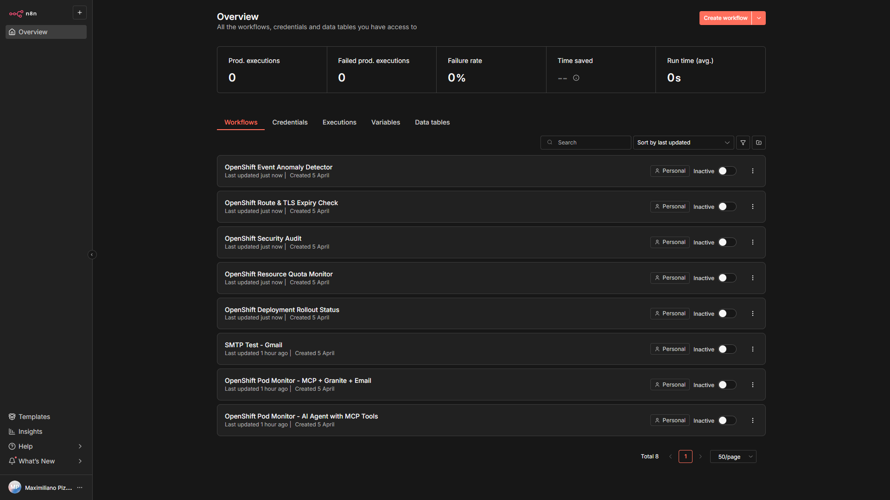
      
n8n - 8 OpenShift MCP Server Workflows Imported

    

  

  <h3>OpenShift MCP Server Workflow Examples</h3>
  

    

      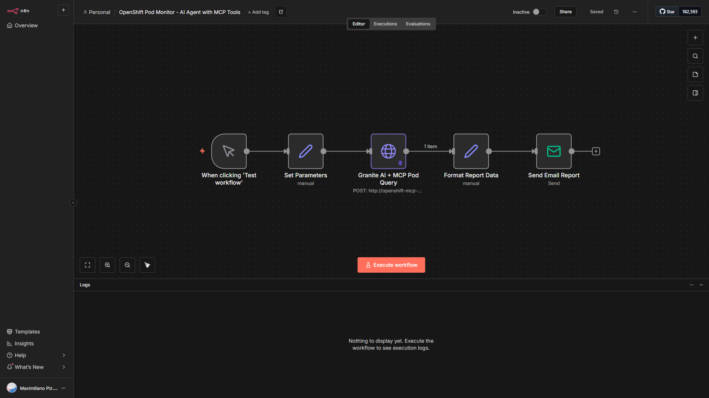
      
1. Pod Monitor - AI Agent with MCP Tools

    

    

      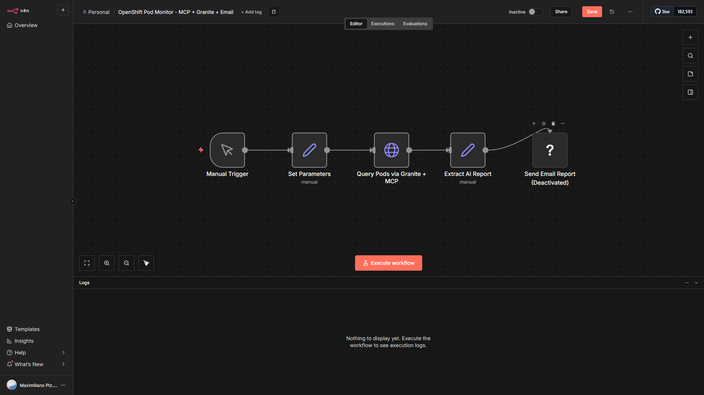
      
2. Pod Monitor - MCP + Granite + Email

    

    

      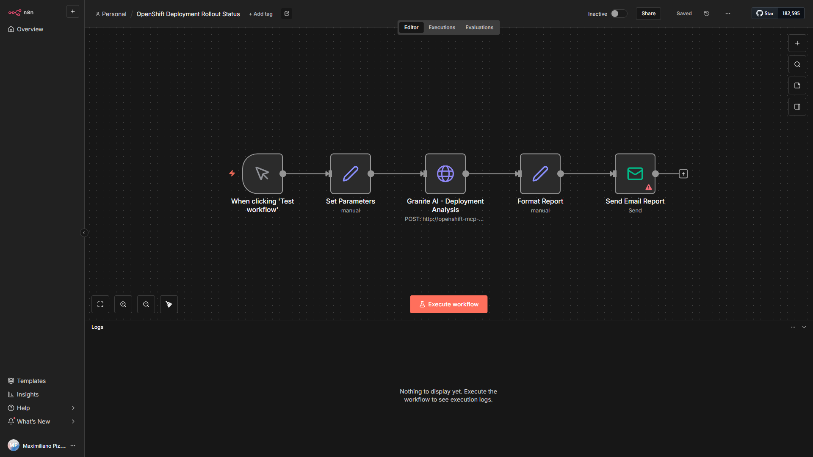
      
3. Deployment Rollout Status

    

    

      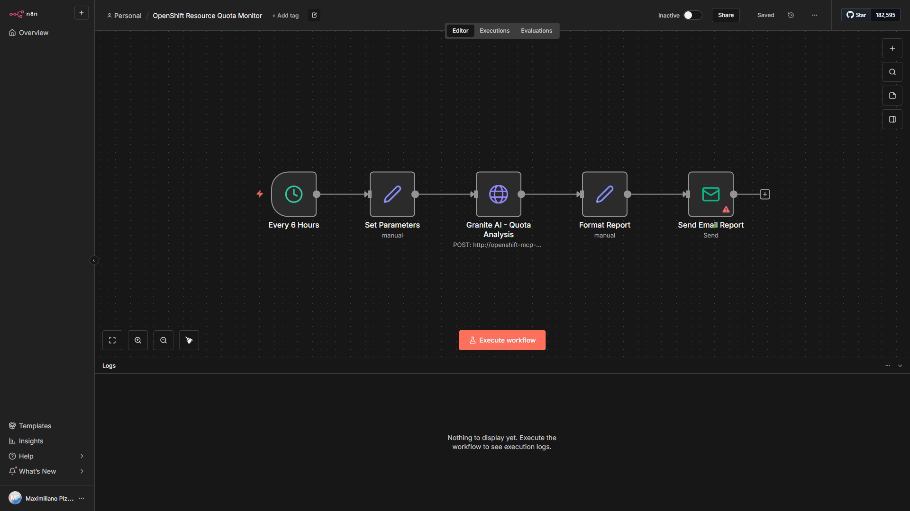
      
4. Resource Quota Monitor

    

    

      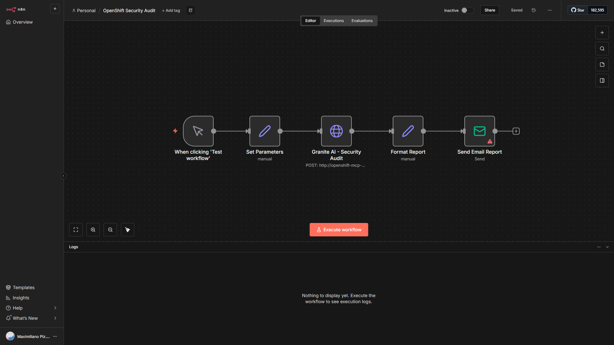
      
5. Security Audit

    

    

      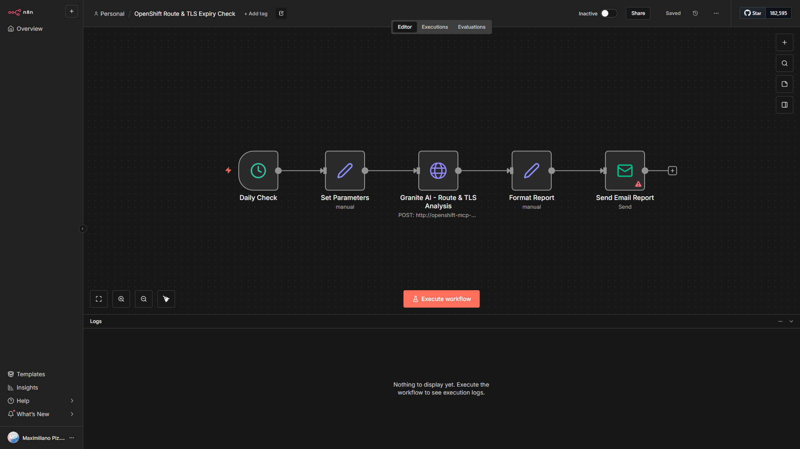
      
6. Route &amp; TLS Expiry Check

    

    

      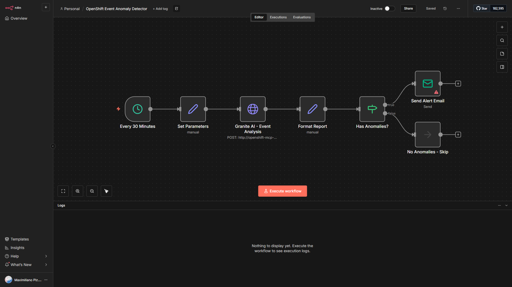
      
7. Event Anomaly Detector

    

    

      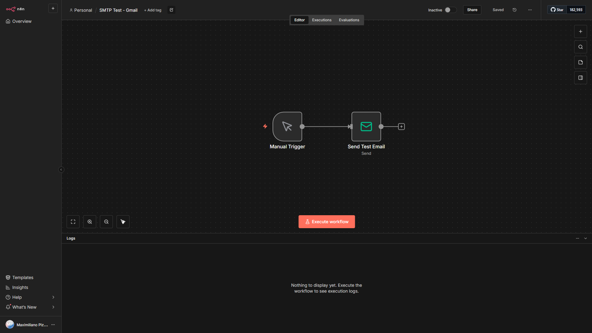
      
SMTP Test - Email via Mailpit

    

  

  <h3>Services</h3>
  

    

      
      
n8n Dashboard Overview

    

    

      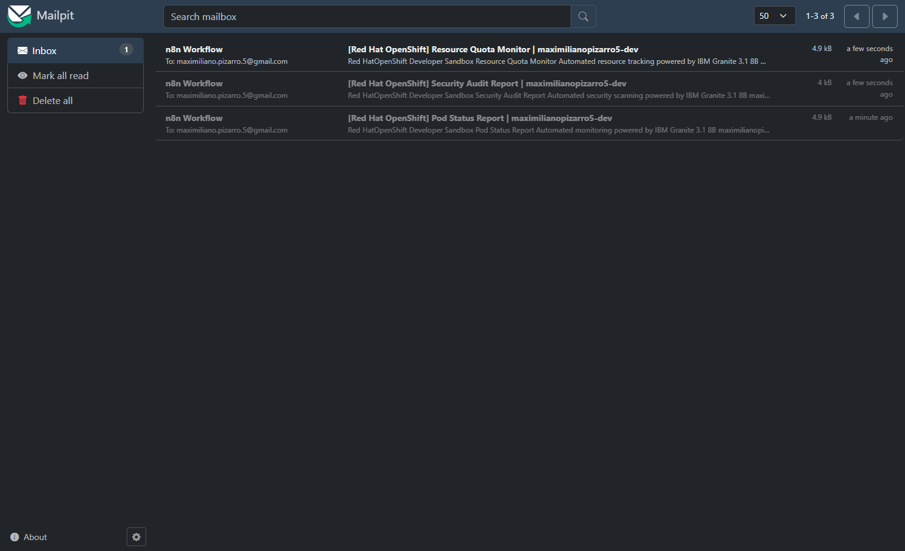
      
Mailpit Inbox - Workflow Email Reports

    

    

      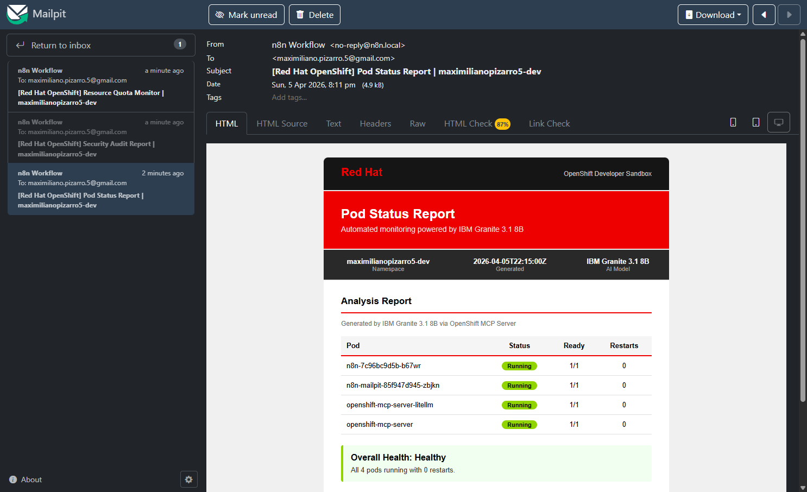
      
Pod Status Report - HTML Email via Mailpit

    

  

  <h3>MCP Inspector - Tool Verification</h3>
  

    

      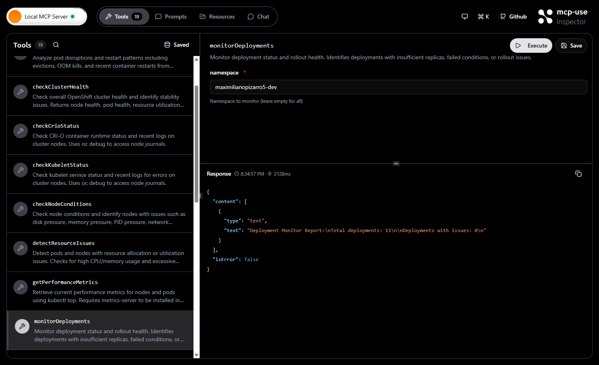
      
MCP Inspector - monitorDeployments: 11 deployments healthy, 0 issues

    

  

  <h2>Installation</h2>
  

    
1

    

      <strong>Add the Helm repository</strong>
      
helm repo add n8n-openshift https://maximilianopizarro.github.io/n8n-helm-chart/ helm repo update

    

  

  

    
2

    

      <strong>Install the chart</strong>
      
helm install n8n n8n-openshift/n8n --version 1.16.0

    

  

  

    
3

    

      <strong>Install on OpenShift Developer Sandbox</strong>
      
oc login --token=&lt;your-token&gt; --server=https://api.&lt;cluster&gt;.openshiftapps.com:6443 helm install n8n n8n-openshift/n8n -f values-sandbox.yaml

    

  

  <h2>Developer Sandbox Quick Start</h2>
  
For Red Hat OpenShift Developer Sandbox, use these values to ensure compatibility with restricted SCCs:

  
enableServiceLinks: false  podSecurityContext: {} securityContext: &nbsp;&nbsp;allowPrivilegeEscalation: false &nbsp;&nbsp;capabilities: &nbsp;&nbsp;&nbsp;&nbsp;drop: &nbsp;&nbsp;&nbsp;&nbsp;&nbsp;&nbsp;- ALL &nbsp;&nbsp;readOnlyRootFilesystem: false &nbsp;&nbsp;runAsNonRoot: true  route: &nbsp;&nbsp;enabled: true &nbsp;&nbsp;sccRoleDisabled: true  main: &nbsp;&nbsp;config: &nbsp;&nbsp;&nbsp;&nbsp;n8n: &nbsp;&nbsp;&nbsp;&nbsp;&nbsp;&nbsp;user_folder: "/data" &nbsp;&nbsp;persistence: &nbsp;&nbsp;&nbsp;&nbsp;enabled: true &nbsp;&nbsp;&nbsp;&nbsp;storageClass: gp3-csi &nbsp;&nbsp;&nbsp;&nbsp;size: 2Gi &nbsp;&nbsp;&nbsp;&nbsp;mountPath: "/data" &nbsp;&nbsp;service: &nbsp;&nbsp;&nbsp;&nbsp;type: ClusterIP &nbsp;&nbsp;&nbsp;&nbsp;port: 5678  mailpit: &nbsp;&nbsp;enabled: true &nbsp;&nbsp;route: &nbsp;&nbsp;&nbsp;&nbsp;enabled: true &nbsp;&nbsp;podSecurityContext: {}

  <table class="styled-table">
    <thead>
      <tr><th>Setting</th><th>Value</th><th>Reason</th></tr>
    </thead>
    <tbody>
      <tr><td><code>enableServiceLinks</code></td><td><code>false</code></td><td>Avoids N8N_PORT env conflict in OpenShift</td></tr>
      <tr><td><code>route.sccRoleDisabled</code></td><td><code>true</code></td><td>Developer Sandbox users cannot create SCC Roles</td></tr>
      <tr><td><code>main.config.n8n.user_folder</code></td><td><code>/data</code></td><td>Writable path for random UID assigned by OpenShift</td></tr>
      <tr><td><code>main.persistence.mountPath</code></td><td><code>/data</code></td><td>Mount PVC at writable path instead of /home/node/.n8n</td></tr>
      <tr><td><code>podSecurityContext</code></td><td><code>{}</code></td><td>No fsGroup (restricted SCC)</td></tr>
      <tr><td><code>main.persistence.storageClass</code></td><td><code>gp3-csi</code></td><td>Sandbox default StorageClass</td></tr>
    </tbody>
  </table>

  <h2>OpenShift MCP Server Workflow Examples</h2>
  
Each workflow follows a <strong>6-node pipeline</strong> that calls MCP Server tools directly via JSON-RPC, passes real cluster data to an AI model for analysis, and delivers a branded HTML email report through Mailpit:

  
Trigger → Set Parameters → <strong>MCP Tool Call</strong> (JSON-RPC) → <strong>AI Analysis</strong> (LiteLLM) → Build HTML Report → Send via Mailpit

  

    <h4>1. Pod Monitor - AI Agent with MCP Tools</h4>
    
Calls <code>pods_list</code> via K8s MCP Server (JSON-RPC over Streamable HTTP) to retrieve all pods in the namespace, then passes the real pod data to Granite/Qwen3 for status analysis and sends a branded HTML email via Mailpit API.

    

      MCP: pods_list
      Granite / Qwen3
      Mailpit
      Manual Trigger
    

  

  

    <h4>2. Pod Monitor - MCP + Granite + Email</h4>
    
Calls <code>monitorDeployments</code> via Quarkus MCP Server to get deployment health metrics, then uses AI to analyze healthy vs unhealthy deployments, replica mismatches, and sends the report via Mailpit.

    

      MCP: monitorDeployments
      Granite / Qwen3
      Mailpit
      Manual Trigger
    

  

  

    <h4>3. Deployment Rollout Status</h4>
    
Calls <code>monitorDeployments</code> to retrieve real-time deployment data, then AI analyzes replica health (desired vs available vs ready), rollout strategy, container image versions, and flags deployments with mismatches.

    

      MCP: monitorDeployments
      Granite / Qwen3
      Mailpit
      Manual Trigger
    

  

  

    <h4>4. Resource Quota Monitor</h4>
    
Calls <code>getPerformanceMetrics</code> via Quarkus MCP Server every 6 hours, then AI analyzes CPU/memory utilization, ResourceQuota limits vs usage, top resource consumers. Flags resources above 80% threshold.

    

      MCP: getPerformanceMetrics
      Granite / Qwen3
      Mailpit
      Schedule (6h)
    

  

  

    <h4>5. Security Audit</h4>
    
Calls <code>checkClusterHealth</code> via Quarkus MCP Server, then AI performs a security posture assessment following CIS benchmarks: ServiceAccount roles, SCC usage, NetworkPolicy, Secrets audit. Findings classified as PASS, WARNING, or CRITICAL.

    

      MCP: checkClusterHealth
      Granite / Qwen3
      Mailpit
      Manual Trigger
    

  

  

    <h4>6. Route &amp; TLS Expiry Check</h4>
    
Calls <code>resources_list</code> (resource_type: routes) via K8s MCP Server daily, then AI analyzes route configuration, TLS termination types, and certificate expiry. Alerts on certificates expiring within 30 days.

    

      MCP: resources_list
      Granite / Qwen3
      Mailpit
      Schedule (daily)
    

  

  

    <h4>7. Event Anomaly Detector</h4>
    
Calls <code>events_list</code> via K8s MCP Server every 30 minutes, then AI detects anomalous Kubernetes Events: repeated warnings, OOMKilled, FailedScheduling, image pull errors. Conditional alerts only when anomalies are found.

    

      MCP: events_list
      Granite / Qwen3
      Mailpit
      Schedule (30min)
    

  

  <table class="styled-table">
    <thead>
      <tr><th>#</th><th>Workflow</th><th>MCP Tool</th><th>MCP Server</th><th>Trigger</th></tr>
    </thead>
    <tbody>
      <tr><td>1</td><td>Pod Monitor - AI Agent</td><td><code>pods_list</code></td><td>K8s MCP (8085)</td><td>Manual</td></tr>
      <tr><td>2</td><td>Pod Monitor - MCP + Granite</td><td><code>monitorDeployments</code></td><td>Quarkus MCP (8080)</td><td>Manual</td></tr>
      <tr><td>3</td><td>Deployment Rollout Status</td><td><code>monitorDeployments</code></td><td>Quarkus MCP (8080)</td><td>Manual</td></tr>
      <tr><td>4</td><td>Resource Quota Monitor</td><td><code>getPerformanceMetrics</code></td><td>Quarkus MCP (8080)</td><td>Schedule (6h)</td></tr>
      <tr><td>5</td><td>Security Audit</td><td><code>checkClusterHealth</code></td><td>Quarkus MCP (8080)</td><td>Manual</td></tr>
      <tr><td>6</td><td>Route &amp; TLS Expiry</td><td><code>resources_list</code></td><td>K8s MCP (8085)</td><td>Schedule (daily)</td></tr>
      <tr><td>7</td><td>Event Anomaly Detector</td><td><code>events_list</code></td><td>K8s MCP (8085)</td><td>Schedule (30min)</td></tr>
    </tbody>
  </table>

  
Find all workflow JSON files in the <a href="https://github.com/maximilianoPizarro/n8n-helm-chart/tree/main/workflows">workflows directory</a> or in the <a href="https://github.com/maximilianoPizarro/n8n-sandbox/tree/main/workflows">n8n-sandbox repository</a>.

  <h2>Mailpit Email Output</h2>
  
When Mailpit is enabled, n8n workflows can send branded HTML email reports that are captured and viewable in the Mailpit web UI. Configure n8n SMTP credentials to point to the Mailpit service:

  
main: &nbsp;&nbsp;config: &nbsp;&nbsp;&nbsp;&nbsp;n8n: &nbsp;&nbsp;&nbsp;&nbsp;&nbsp;&nbsp;smtp_host: "&lt;release-name&gt;-mailpit" &nbsp;&nbsp;&nbsp;&nbsp;&nbsp;&nbsp;smtp_port: "1025" &nbsp;&nbsp;&nbsp;&nbsp;&nbsp;&nbsp;smtp_ssl: "false"

  
Access the Mailpit web UI via its OpenShift Route to view all captured email reports from your workflows.

  

    

      
      
Mailpit Inbox - Workflow Email Reports

    

    

      
      
Pod Status Report - Rendered HTML Email

    

  

  <h2>OpenShift MCP Server</h2>
  
The workflows above require the <a href="https://artifacthub.io/packages/helm/openshift-mcp-server/openshift-mcp-server">OpenShift MCP Server</a> Helm chart deployed in your cluster. It provides a dual MCP server deployment: a custom Quarkus server (19 operational tools) and the official <a href="https://github.com/openshift/openshift-mcp-server">openshift/openshift-mcp-server</a> (20+ Kubernetes tools), plus an MCP Inspector UI and LiteLLM proxy.

  

    
  

  

    
1

    

      <strong>Add the Helm repository</strong>
      
helm repo add openshift-mcp https://maximilianoPizarro.github.io/openshift-mcp-server helm repo update

    

  

  

    
2

    

      <strong>Install the OpenShift MCP Server</strong>
      
helm install openshift-mcp-server openshift-mcp/openshift-mcp-server \ &nbsp;&nbsp;--namespace openshift-lightspeed \ &nbsp;&nbsp;--create-namespace \ &nbsp;&nbsp;--set namespace=openshift-lightspeed

    

  

  

    
3

    

      <strong>Install on Developer Sandbox (same namespace as n8n)</strong>
      
helm install openshift-mcp-server openshift-mcp/openshift-mcp-server \ &nbsp;&nbsp;--set namespace=&lt;your-sandbox-namespace&gt;

    

  

  <table class="styled-table">
    <thead>
      <tr><th>Component</th><th>Port</th><th>Description</th></tr>
    </thead>
    <tbody>
      <tr><td><strong>Quarkus MCP Server</strong></td><td>8080</td><td>19 tools: monitoring, deployment, performance testing</td></tr>
      <tr><td><strong>K8s MCP Server</strong></td><td>8085</td><td>20+ tools: CRUD, pods, helm, events, nodes</td></tr>
      <tr><td><strong>MCP Inspector</strong></td><td>8080</td><td>Web UI for testing MCP tools interactively</td></tr>
      <tr><td><strong>LiteLLM Proxy</strong></td><td>4000</td><td>OpenAI-compatible proxy for Granite/Qwen3 models</td></tr>
    </tbody>
  </table>

  
Full documentation: <a href="https://maximilianopizarro.github.io/openshift-mcp-server">maximilianopizarro.github.io/openshift-mcp-server</a>

  <h2>Configuration</h2>
  <h3>N8n Configuration via Values</h3>
  
Configuration under <code>main.config:</code> and <code>main.secret:</code> in <code>values.yaml</code> is transformed 1:1 into Kubernetes ENV variables:

  
main: &nbsp;&nbsp;config: &nbsp;&nbsp;&nbsp;&nbsp;n8n: &nbsp;&nbsp;&nbsp;&nbsp;&nbsp;&nbsp;encryption_key: "my_secret"&nbsp;&nbsp;# =&gt; N8N_ENCRYPTION_KEY=my_secret &nbsp;&nbsp;&nbsp;&nbsp;db: &nbsp;&nbsp;&nbsp;&nbsp;&nbsp;&nbsp;type: postgresdb&nbsp;&nbsp;&nbsp;&nbsp;&nbsp;&nbsp;&nbsp;&nbsp;&nbsp;&nbsp;&nbsp;&nbsp;&nbsp;# =&gt; DB_TYPE=postgresdb &nbsp;&nbsp;&nbsp;&nbsp;&nbsp;&nbsp;postgresdb: &nbsp;&nbsp;&nbsp;&nbsp;&nbsp;&nbsp;&nbsp;&nbsp;host: 192.168.0.52&nbsp;&nbsp;&nbsp;&nbsp;&nbsp;&nbsp;&nbsp;&nbsp;&nbsp;# =&gt; DB_POSTGRESDB_HOST=192.168.0.52

  
Consult the <a href="https://docs.n8n.io/hosting/configuration/environment-variables/">n8n Environment Variables Documentation</a>.

  <h3>Enabling Mailpit</h3>
  
mailpit: &nbsp;&nbsp;enabled: true &nbsp;&nbsp;route: &nbsp;&nbsp;&nbsp;&nbsp;enabled: true&nbsp;&nbsp;# Expose web UI via OpenShift Route &nbsp;&nbsp;smtp: &nbsp;&nbsp;&nbsp;&nbsp;port: 1025 &nbsp;&nbsp;ui: &nbsp;&nbsp;&nbsp;&nbsp;port: 8025

  <h3>Basic Deployment with Ingress</h3>
  
ingress: &nbsp;&nbsp;enabled: true &nbsp;&nbsp;hosts: &nbsp;&nbsp;&nbsp;&nbsp;- host: n8n.mydomain.com &nbsp;&nbsp;&nbsp;&nbsp;&nbsp;&nbsp;paths: &nbsp;&nbsp;&nbsp;&nbsp;&nbsp;&nbsp;&nbsp;&nbsp;- path: / &nbsp;&nbsp;&nbsp;&nbsp;&nbsp;&nbsp;&nbsp;&nbsp;&nbsp;&nbsp;pathType: Prefix

  <h3>Queue Mode with External Redis</h3>
  
db: &nbsp;&nbsp;type: postgresdb  externalPostgresql: &nbsp;&nbsp;host: "postgresql.example.com" &nbsp;&nbsp;username: "n8nuser" &nbsp;&nbsp;password: "secure-password" &nbsp;&nbsp;database: "n8n"  worker: &nbsp;&nbsp;mode: queue  externalRedis: &nbsp;&nbsp;host: "redis.example.com" &nbsp;&nbsp;username: "default" &nbsp;&nbsp;password: "secure-password"

  <h2>Container Image</h2>
  
A Red Hat UBI-based container image is available at <code>quay.io/maximilianopizarro/n8n</code>. It clones the official n8n source, builds it, and runs on a Red Hat certified base image (<code>registry.access.redhat.com/ubi9/nodejs-22</code>).

  
image: &nbsp;&nbsp;repository: quay.io/maximilianopizarro/n8n &nbsp;&nbsp;tag: "1.123.28"

  
The image is built automatically via GitHub Actions on every push to <code>main</code>.

  <h2>Requirements</h2>
  <table class="styled-table">
    <thead>
      <tr><th>Requirement</th><th>Version</th></tr>
    </thead>
    <tbody>
      <tr><td>Kubernetes</td><td>&gt;= 1.20.0</td></tr>
      <tr><td>Helm</td><td>&gt;= 3.8</td></tr>
      <tr><td>Database</td><td>SQLite (embedded) or PostgreSQL</td></tr>
    </tbody>
  </table>
  <table class="styled-table">
    <thead>
      <tr><th>Dependency</th><th>Version</th><th>Condition</th></tr>
    </thead>
    <tbody>
      <tr><td>Valkey (Bitnami)</td><td>2.4.7</td><td><code>valkey.enabled</code></td></tr>
    </tbody>
  </table>

  <h2>Release Notes</h2>

  <h3>v1.16.0 (n8n 1.123.28)</h3>

  <h4 style="color:var(--n8n-green);margin-top:20px;">Added</h4>
  <ul>
    <li><strong>OpenShift MCP Server integration</strong> — 7 workflows calling MCP tools directly via JSON-RPC (<code>pods_list</code>, <code>monitorDeployments</code>, <code>getPerformanceMetrics</code>, <code>checkClusterHealth</code>, <code>events_list</code>, <code>resources_list</code>) with AI analysis (Granite/Qwen3 via LiteLLM) and branded HTML email reports via Mailpit</li>
    <li><strong>Workflow auto-import Job</strong> — Helm post-install hook downloads and imports workflow JSON files from <a href="https://github.com/maximilianoPizarro/n8n-sandbox">n8n-sandbox</a></li>
    <li><strong>Mailpit</strong> — Optional SMTP test server with web UI for previewing email reports without external email infrastructure</li>
    <li><strong>Developer Sandbox compatibility</strong> — <code>enableServiceLinks: false</code> to avoid <code>N8N_PORT</code> env conflict, <code>route.sccRoleDisabled</code> for restricted RBAC, empty <code>podSecurityContext</code> for random UID</li>
    <li><strong>Red Hat UBI container image</strong> — Built on <code>registry.access.redhat.com/ubi9/nodejs-22</code>, published at <code>quay.io/maximilianopizarro/n8n</code> via GitHub Actions</li>
    <li><strong>Configurable volume mount path</strong> — <code>main.persistence.mountPath</code> for writable paths in restricted environments</li>
    <li><strong>Chart Verifier CI</strong> — GitHub Actions workflow runs Red Hat Community Helm Chart verification on every push</li>
  </ul>

  <h4 style="color:var(--n8n-blue);margin-top:20px;">Changed</h4>
  <ul>
    <li>Updated n8n app version to <strong>1.123.28</strong></li>
    <li>Dynamic naming in RBAC resources using chart naming helpers</li>
    <li>Architecture diagram updated to Mermaid with MCP Server and AI layer</li>
    <li>GitHub Pages documentation redesigned with n8n-inspired style, lightbox image viewer, and MCP workflow pipeline documentation</li>
  </ul>

  <h4 style="color:var(--n8n-primary);margin-top:20px;">Fixed</h4>
  <ul>
    <li>Fixed <code>ClusterIP_</code> typo in service template</li>
    <li>Fixed hardcoded names in <code>role.yaml</code> to use chart naming helpers (supports <code>n8n-dev-east</code> style release names)</li>
  </ul>

  <h4 style="margin-top:24px;">Email Report Screenshots</h4>
  
Actual email reports generated by the MCP workflows and captured in Mailpit:

  

    

      
      
Mailpit Inbox — Resource Quota, Security Audit, Pod Status reports

    

    

      
      
Pod Status Report — Red Hat branded HTML with pod health table, AI analysis by Granite 3.1 8B

    

  

  <h3 style="margin-top:32px;">Upgrade</h3>
  
helm repo update helm upgrade [RELEASE_NAME] n8n-openshift/n8n --version 1.16.0

  <h3>Uninstall</h3>
  
helm uninstall [RELEASE_NAME]

  &times;
  
  

<footer class="site-footer">
  
<strong>n8n Helm Chart</strong> &mdash; Maintained by <a href="https://github.com/maximilianoPizarro">maximilianoPizarro</a>

  
n8n is licensed under <a href="https://github.com/n8n-io/n8n/blob/master/LICENSE.md">Sustainable Use License</a>. IBM Granite models are licensed under <a href="https://www.apache.org/licenses/LICENSE-2.0">Apache 2.0</a>.

  
<a href="https://github.com/maximilianoPizarro/n8n-helm-chart">GitHub</a> &bull; <a href="https://artifacthub.io/packages/search?repo=n8n-openshift">Artifact Hub</a> &bull; <a href="https://n8n.io/">n8n.io</a>

</footer>
